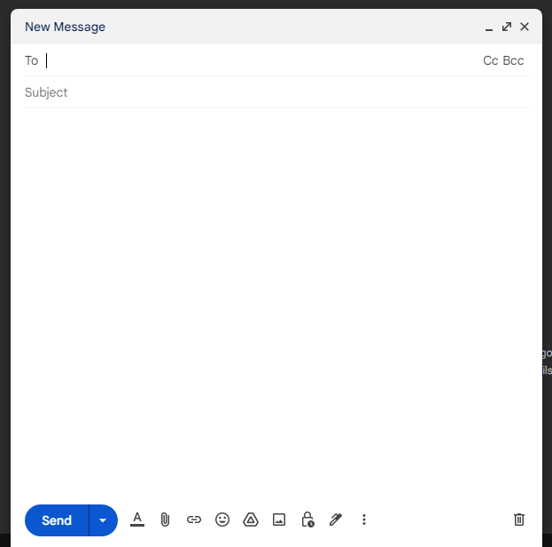
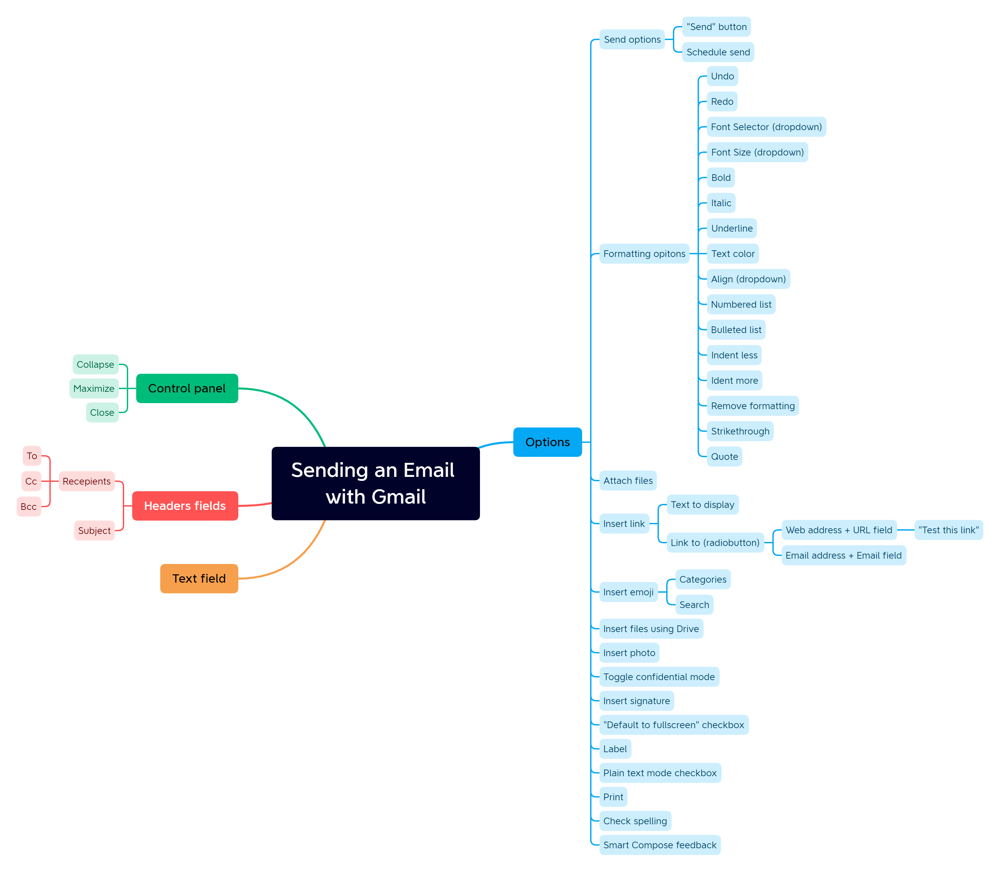

# Making checklist for testing a Gmail

Suppose we'd want to test how sending emails via Google works ("Compose" feature). For this, we have to prepare a comprehensive list of checks,
that later will be used for actual manual testing. Writing a checklist helps overcome human memory imperfections. The more complex tested system is, the more necessary
becomes a mind map of a system, which is the base of our future checklist. So the whole process consists of two components:

## Overview
1. Creating a mind map
2. Writing a checklist based on mind map

Google mail [has a manual](https://support.google.com/mail), so the checklist will be written according to it. If the function is not described in manual,
a check will be set with just assuming result.

## 1. Creating a mind map

Gmail's "Compose" greets us with a new window at the right bottom corner of a browser:

We have to click through every clickable entity and register visually how system responds. There are text fields, menus, submenus, dropdowns, radiobuttons, etc. For future convenience, I also write these types alongside with names of functions. After this tedious process the mind map is ready. You can see it below.

## 2. Writing a checklist

Now we have to come up with a few checks for every branch of a mind map tree. This checks all should find system capable of performing tasks it was designed for
(positive check) and adequately respond to user's possible wrong actions at the same time (negative check). The checks are also have smoke, critical path, or extended
priority, and I register that.

### Control panel

| ID    | Priority    | Check                                                                     |
|-------|-------------|---------------------------------------------------------------------------|
| C001  | CP          | Window successfully collapses, expands; email content kept
| C002  | CP          | Window successfully maximizes, unmaximizes, email content kept
| C003  | CP          | Window closes; does unfinished email go to *Drafts*?

### Headers fields

| ID    | Priority    | Check                                                                     | Comments                              |
|-------|-------------|---------------------------------------------------------------------------|---------------------------------------|
| H001  | Smoke       | Email is sent with a valid address in "To" field and "Subject" field is filled | Try different email providers, try temporary addresses
| H002  | Ext         | Email is sent to self
| H003  | Ext         | Email won't send if "To" field is empty
| H004  | CP          | Email is sent if "Cc" field contains valid emails; receivers see addresses of others
| H005  | CP          | Email is sent if "Bcc" field contains valid emails; receivers won't see addresses of others
| H006  | CP          | Email won't send if "To", "Cc", or "Bcc" fields contains invalid addresses
| H007  | Ext         | Email won't send if "Subject" field is not filled

### Text field

| ID    | Priority    | Check                                                                     | Comments                              |
|-------|-------------|---------------------------------------------------------------------------|---------------------------------------|
| T001  | Smoke       | Text entered from keyboard
| T002  | Smoke       | Text pasted from clipboard; formatting kept
| T003  | Smoke       | Text copied to clipboard; formatting kept
| T004  | CP          | Non-ASCII characters displayed properly | Try emojis
| T005  | Ext         | Images pasted from clipboard

### Options
#### Formatting

| ID    | Priority    | Check                                                                     | Comments                              |
|-------|-------------|---------------------------------------------------------------------------|---------------------------------------|
| O001  | CP          | Scheduled email sent at desired time
| O002  | Ext         | It is not possible to choose past time for scheduled send
| O003  | CP          | The state before last action restored with *Undo* function | Try undo not only entered data, but also deleted
| O004  | Ext         | The series of last actions restored with *Undo*
| O005  | CP          | Restoring with *Undo* canceled with *Redo*
| O006  | Ext         | The series of *Undo's* canceled with series of *Redo's*
| O007  | CP          | After *PROPERTY* selected text entered next has new *PROPERTY*| *PROPERTIES* are: *Font*, *Font size*, *Bold*, *Italic*, *Underline*, *Text color*, *Background color*, *Strikethrough*
| O008  | CP          | Selected text's *PROPERTY* changed if select some text and then change *PROPERTY* | *PROPERTIES* are: *Font*, *Font size*, *Bold*, *Italic*, *Underline*, *Text color*, *Background color*, *Strikethrough*
| O009  | CP          | Selected lines of text or line of text where the cursor is, aligned left, center, or right
| O010  | CP          | Selected lines of text becomes numbered or bulleted
| O011  | CP          | Selected lines of text indent less or more
| O012  | Ext         | Nested indentation works using *Numbered*/*Bulleted list* and *Indent*
| O013  | CP          | Selected lines of text becomes a quote
| O014  | CP          | Un-quotation works
| O015  | CP          | Selected lines of text lose formatting with *Remove formatting*

#### Other

| ID    | Priority    | Check                                                                     | Comments                              |
|-------|-------------|---------------------------------------------------------------------------|---------------------------------------|
| O016  | CP          | All file formats could be attached | Try files with no filename extension, try empty file
| O017  | CP          | Files from Google Drive could be attached | Does private files could be shared?
| O018  | CP          | Photos inserted
| O019  | CP          | *Compose* window is fullscreen after page reload if "Default to fullscreen" is checked

## Summary

This list of check covers all the functions available via *Compose*. It could be used for testing right away, or test cases could be written for every check.
