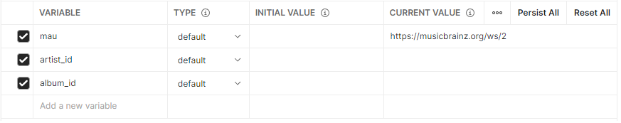
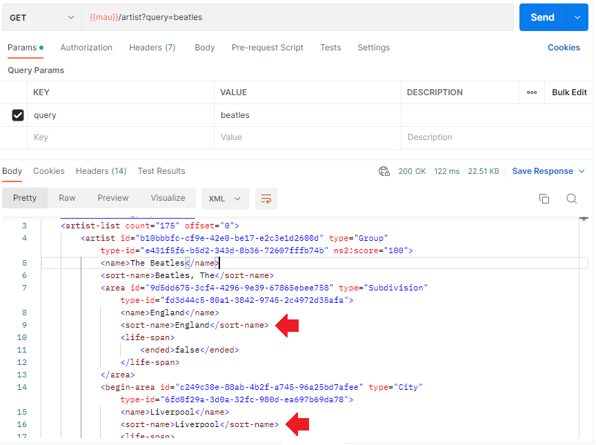
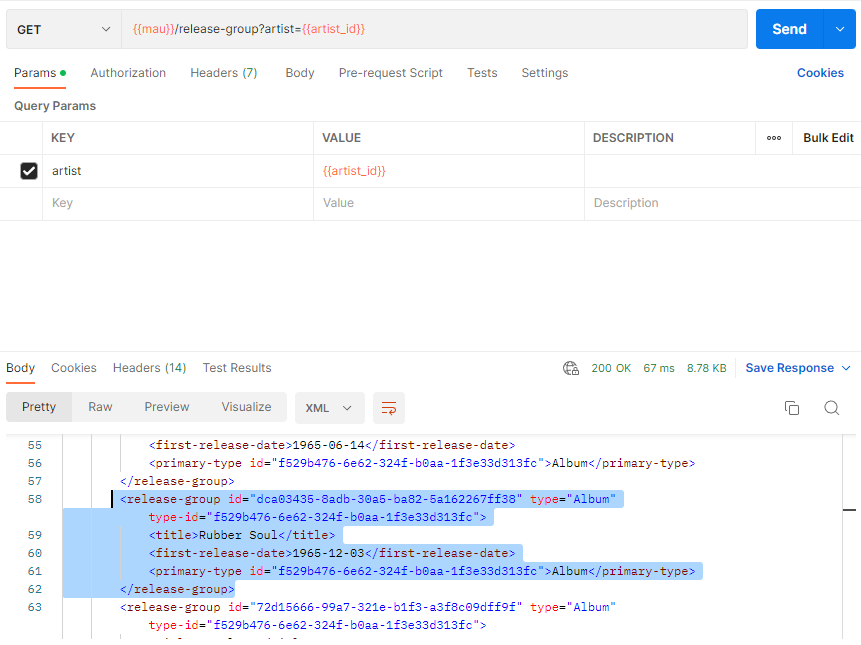
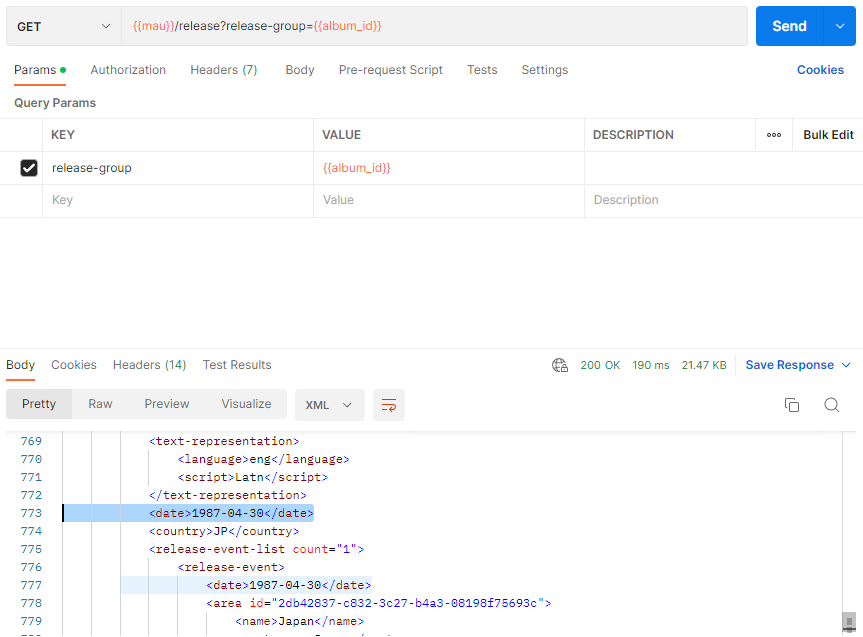

# Postman Collections

Making HTTP requests is a key action in software testing. It has the final say
if question of proper behavior of web application is asked.

Postman is a computer program that makes sending HTTP requests easy. The common
entity in it is a *Collection* — a set of requests templates made for
convenience of reusing in future. To use Postman we have to decide inside which
REST API we will work. This API should have all its calling methods well
described in documentation, and, for the sake of our convenience, be open (have
no authorization token asked in requests).

There are such APIs — MusicBrainz API, for example. MusicBrainz is a is an open
music encyclopedia, containing all possible info about music ever released. Its
API [manual](https://musicbrainz.org/doc/MusicBrainz_API) available here. We
will be using its API to demonstrate Postman workflow.

Let's say we'd want to find info about the most recent re-issue of the 1965
The Beatles' album *Rubber Soul*. The steps will be as follows:

## Overview
1. Locate *The Beatles* in MusicBrainz database
2. Select the first album in discography
3. Find info about the last release of the album

## Setting variables

In order to better show the logic of the process and to type less, it is useful
to set a couple of variables. It is done in ***Global*** tab. We will set these
variables:

1. *mau* (for Main URL), containing the main address API is available at;
2. *artist_id* for when we find out ID of the artist in database; we leave it
empty for now;
3. *album_id*, same for album.

## Identifying the artist

According to documentation, identifying goes like this:

We had to append our URN for the first time with query string *query* (😁).
After hitting *Send* we got a lot of results with first one probably the correct
one. The was no other The Beatles artist from Liverpool, England, so we assume
them as one and will be browsing through theirs discography next. The red arrows
in picture above highlights the hints we used to ID the artist. We copy the ID
under *artist id* tag.

## Selecting the album

The artist being identified, it is time do this with a correct album. Again, we
are looking for *Rubber Soul*, the album The Beatles released in 1965. Now we
have to use artist's ID in query. Before forming a request, it is necessary to
fill the variable value in our *environment*. After that we can do the GET
request:

Scrolling through response body the album is found. Highlighted text points to
it. We copy the ID under *release-group id* tag.

## Searching the specified release

Now with album ID found we have to search for the most recent re-issue of it.
The step is almost identical as the last one. We fill in next environment
variable, change a couple of words to other in GET request text, and hit "Send":

The release we are searching for is probably at the bottom of request body, but
the most recent date there is 1987, which is not looks right. It does not seem
correct if the last time The Beatles' album was re-issued was 1987. This check
becomes supported by web version of MusicBrainz, if make same requests we did
through API there. We add another query to GET request:

    limit: 100

And this does expands the response. The most recent date is now 2017:

    <release id="ddb7edd9-1318-45ef-851e-e1cf7ba83ed6">
                <title>Rubber Soul</title>
                <status id="4e304316-386d-3409-af2e-78857eec5cfe">Official</status>
                <quality>normal</quality>
                <text-representation>
                    <language>eng</language>
                    
                </text-representation>
                <date>2017-11-03</date>  <--- Looks correct

Re-check with increasing *limit* once more

    limit: 1000

Returns same result, which says that we found what we were looking for. The most
recent re-issue of the The Beatles' album *Rubber Soul* was in 2017.

## Summary

It is absolutely possible to do HTTP requests without Postman, but it greatly
increases productivity of a tester providing much control over elements of a
request elements (queries, values, repeated steps sequences).
