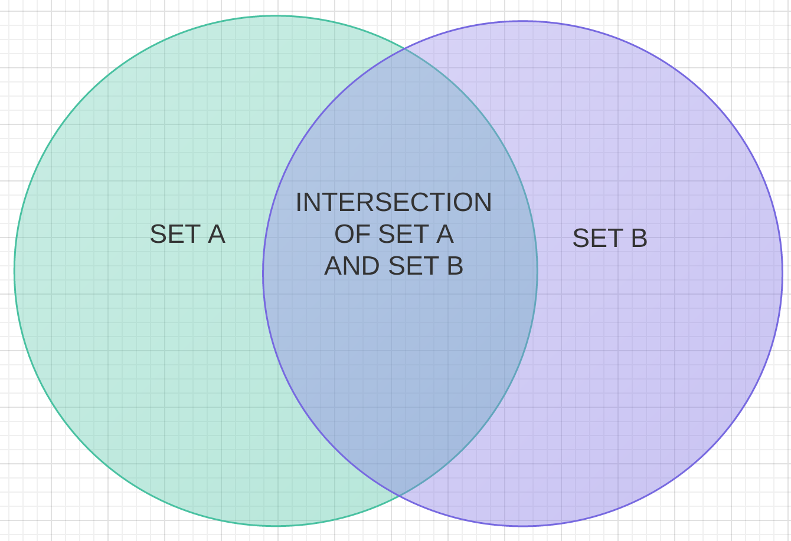
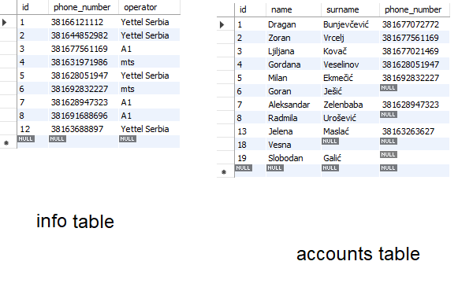

# SQL Queries

**Overview:**
1. **CREATING** tables and filling it with correct data;
2. **SELECTING** to check if everything OK;
3. **JOIN** tables.

To properly see the power of INNER/LEFT/RIGHT JOINS it is better to use data
that could be represented in two sets with fractions intersecting:

On the image above we can clearly see what result of SQL JOINS will look like:
- The dark area of intersection is the result of INNER JOIN
- The dark plus green area represents the result of LEFT JOIN
- The dark plus purple area represents the result of RIGHT JOIN

We choose to use: 1) the collection of phone numbers connected the company it is
operated by; 2) the collection of people's ID where not everyone has a phone
number.

## 1. Creating database

    CREATE DATABASE phones;
    USE phones;

    CREATE table info(
    -> id INT(10) NOT NULL,
    -> phone_number BIGINT NULL,                                            // Phone number row
    -> operator VARCHAR(55) NULL,                                           // Operator's name row
    -> PRIMARY KEY (id)
    -> );

    CREATE table accounts(
    -> id INT(10) NOT NULL,
    -> name VARCHAR(25) NULL,                                               // First name
    -> surname VARCHAR(25) NULL,                                            // Last name
    -> phone_number BIGINT NULL,                                            // Phone number
    -> PRIMARY KEY (id)
    -> );

I filled the tables with this data:

There are phone numbers in the first table that are also present in the second;
others does not. This exact difference will show the effect of INNER, LEFT and
RIGHT JOINING. We also made IDs not following continious order, so it will also
be possible to demonstrate JOIN effect ON (though the resulting table will not
have any applicable sense).

## 2. Joining tables

Joining tables allows to see the information from multiple tables at once. The
main problem is to decide how and where to "stitch" the rows, and the solution
is to pick specific row from one table and one from the other, in which we sure
equal values are present. For example, we would want to know what mobile
operator each user in our database prefers. Let's INNER JOIN two tables ON the
phone number:

    SELECT accounts.*, info.operator
    -> FROM accounts
    -> INNER JOIN info
    -> ON accounts.phone_number=info.phone_number
    -> ORDER BY accounts.surname;

    +----+------------+-----------+--------------+---------------+
    | id | name       | surname   | phone_number | operator      |
    +----+------------+-----------+--------------+---------------+
    |  5 | Milan      | Ekmečić   | 381692832227 | mts           |
    |  4 | Gordana    | Veselinov | 381628051947 | Yettel Serbia |
    |  2 | Zoran      | Vrcelj    | 381677561169 | A1            |
    |  7 | Aleksandar | Zelenbaba | 381628947323 | A1            |
    +----+------------+-----------+--------------+---------------+

This response shows all columns requested from both tables, but only the rows
containing identical phone numbers. To also include all the rows from the first
(left) table, one should use LEFT JOIN:

    SELECT accounts.*, info.operator
    -> FROM accounts
    -> LEFT JOIN info
    -> ON accounts.phone_number=info.phone_number
    -> ORDER BY accounts.surname;

    +----+------------+---------------+--------------+---------------+
    | id | name       | surname       | phone_number | operator      |
    +----+------------+---------------+--------------+---------------+
    | 18 | Vesna      | NULL          |         NULL | NULL          |
    |  1 | Dragan     | Bunjevčević   | 381677072772 | NULL          |
    |  5 | Milan      | Ekmečić       | 381692832227 | mts           |
    | 19 | Slobodan   | Galić         |         NULL | NULL          |
    |  6 | Goran      | Ješić         |         NULL | NULL          |
    |  3 | Ljiljana   | Kovač         | 381677021469 | NULL          |
    | 13 | Jelena     | Maslać        |  38163263627 | NULL          |
    |  8 | Radmila    | Urošević      |         NULL | NULL          |
    |  4 | Gordana    | Veselinov     | 381628051947 | Yettel Serbia |
    |  2 | Zoran      | Vrcelj        | 381677561169 | A1            |
    |  7 | Aleksandar | Zelenbaba     | 381628947323 | A1            |
    +----+------------+---------------+--------------+---------------+

As we can see, not every phone number has definite mobile operator. Otherwise we
would see this person in INNER JOIN response. We are left with RIGHT JOIN
request. It will show not only the tables intersection, but all the remaining
rows from operators table:

    SELECT accounts.*, info.operator
    -> FROM accounts
    -> RIGHT JOIN info
    -> ON accounts.phone_number=info.phone_number
    -> ORDER BY accounts.surname;

    +------+------------+-----------+--------------+---------------+
    | id   | name       | surname   | phone_number | operator      |
    +------+------------+-----------+--------------+---------------+
    | NULL | NULL       | NULL      |         NULL | Yettel Serbia |
    | NULL | NULL       | NULL      |         NULL | Yettel Serbia |
    | NULL | NULL       | NULL      |         NULL | mts           |
    | NULL | NULL       | NULL      |         NULL | A1            |
    | NULL | NULL       | NULL      |         NULL | Yettel Serbia |
    |    5 | Milan      | Ekmečić   | 381692832227 | mts           |
    |    4 | Gordana    | Veselinov | 381628051947 | Yettel Serbia |
    |    2 | Zoran      | Vrcelj    | 381677561169 | A1            |
    |    7 | Aleksandar | Zelenbaba | 381628947323 | A1            |
    +------+------------+-----------+--------------+---------------+

### 2.1 Joining on ID

Again, responses below won't have any practical meaning, but in other cases
(for example, where both tables are appended simultaneously with related
information) it may be useful. I did this to my database just as an experiment.
INNER JOIN (IDs are the same):

    SELECT accounts.*, info.operator
    -> FROM accounts
    -> INNER JOIN info
    -> ON accounts.id=info.id
    -> ORDER BY accounts.surname;

    +----+------------+---------------+--------------+---------------+
    | id | name       | surname       | phone_number | operator      |
    +----+------------+---------------+--------------+---------------+
    |  1 | Dragan     | Bunjevčević   | 381677072772 | Yettel Serbia |
    |  5 | Milan      | Ekmečić       | 381692832227 | Yettel Serbia |
    |  6 | Goran      | Ješić         |         NULL | mts           |
    |  3 | Ljiljana   | Kovač         | 381677021469 | A1            |
    |  8 | Radmila    | Urošević      |         NULL | A1            |
    |  4 | Gordana    | Veselinov     | 381628051947 | mts           |
    |  2 | Zoran      | Vrcelj        | 381677561169 | Yettel Serbia |
    |  7 | Aleksandar | Zelenbaba     | 381628947323 | A1            |
    +----+------------+---------------+--------------+---------------+

LEFT JOIN:

    SELECT accounts.*, info.operator
    -> FROM accounts
    -> LEFT JOIN info
    -> ON accounts.id=info.id
    -> ORDER BY accounts.surname;

    +----+------------+---------------+--------------+---------------+
    | id | name       | surname       | phone_number | operator      |
    +----+------------+---------------+--------------+---------------+
    | 18 | Vesna      | NULL          |         NULL | NULL          |
    |  1 | Dragan     | Bunjevčević   | 381677072772 | Yettel Serbia |
    |  5 | Milan      | Ekmečić       | 381692832227 | Yettel Serbia |
    | 19 | Slobodan   | Galić         |         NULL | NULL          |
    |  6 | Goran      | Ješić         |         NULL | mts           |
    |  3 | Ljiljana   | Kovač         | 381677021469 | A1            |
    | 13 | Jelena     | Maslać        |  38163263627 | NULL          |
    |  8 | Radmila    | Urošević      |         NULL | A1            |
    |  4 | Gordana    | Veselinov     | 381628051947 | mts           |
    |  2 | Zoran      | Vrcelj        | 381677561169 | Yettel Serbia |
    |  7 | Aleksandar | Zelenbaba     | 381628947323 | A1            |
    +----+------------+---------------+--------------+---------------+

RIGHT JOIN:

    SELECT accounts.*, info.operator
    -> FROM accounts
    -> RIGHT JOIN info
    -> ON accounts.id=info.id
    -> ORDER BY accounts.surname;

    +------+------------+---------------+--------------+---------------+
    | id   | name       | surname       | phone_number | operator      |
    +------+------------+---------------+--------------+---------------+
    | NULL | NULL       | NULL          |         NULL | Yettel Serbia |
    |    1 | Dragan     | Bunjevčević   | 381677072772 | Yettel Serbia |
    |    5 | Milan      | Ekmečić       | 381692832227 | Yettel Serbia |
    |    6 | Goran      | Ješić         |         NULL | mts           |
    |    3 | Ljiljana   | Kovač         | 381677021469 | A1            |
    |    8 | Radmila    | Urošević      |         NULL | A1            |
    |    4 | Gordana    | Veselinov     | 381628051947 | mts           |
    |    2 | Zoran      | Vrcelj        | 381677561169 | Yettel Serbia |
    |    7 | Aleksandar | Zelenbaba     | 381628947323 | A1            |
    +------+------------+---------------+--------------+---------------+

## Summary

Resulting tables show the power of SQL JOINS. Where there is an identical data
in database, it could help to connect different kinds of information and find
interesting and maybe unexpected relations.
